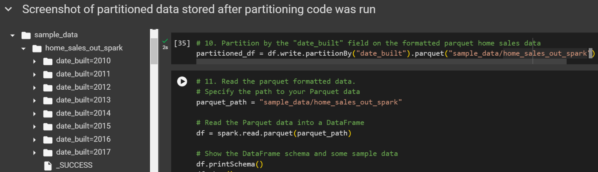

# Home Sales Metrics with SparkSQL

Welcome to the Home Sales Metrics project! In this challenge, we dive into the world of SparkSQL to analyze and derive key insights from home sales data. Using the power of Apache Spark, we aim to perform a comprehensive examination of the data, creating temporary views, partitioning, and optimizing queries for efficient processing.

## Project Overview

As real estate data becomes increasingly voluminous, the ability to extract valuable insights becomes paramount. Leveraging the capabilities of SparkSQL, we embark on a journey to uncover crucial metrics that shed light on the dynamics of home sales. Through the implementation of Spark functionalities, including creating temporary views, partitioning data, and strategically caching tables, we enhance the efficiency and performance of our analysis.

## Key Objectives

1. **Data Exploration:** Gain a deeper understanding of the home sales dataset through exploratory analysis.

2. **Temporary Views:** Utilize SparkSQL to create temporary views for seamless querying and analysis.

3. **Data Partitioning:** Optimize data storage and retrieval by partitioning the dataset for improved efficiency.

4. **Caching Strategies:** Explore the benefits of caching and uncaching temporary tables for enhanced performance.

## Getting Started

Before diving into the project, make sure you have Apache Spark installed and configured on your system. Check out the provided documentation for instructions on setting up the environment.

## How to Use This Repository

1. Clone the repository to your local machine.
2. Navigate to the project directory.
3. Follow the step-by-step guide in the documentation to run and analyze the home sales data using SparkSQL.

## Contributions

Contributions and feedback are highly encouraged! If you encounter issues or have suggestions for improvements, please feel free to create a pull request or submit an issue.

Happy coding!

---

Feel free to customize it based on additional details or specific instructions for users.
